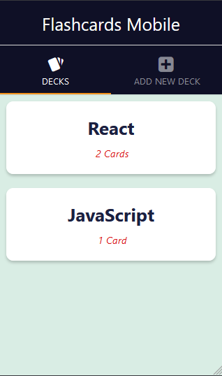

# Mobile Flashcards UdacityND Project

  <!-- iOS -->
  
  <!-- Android -->
  
  <!-- Web -->
  

## 🚀 How to use

- Install packages with `yarn` or `npm install`.
  - If you have native iOS code run `npx pod-install`
- Run `yarn start` to start the bundler.
- Open the project in a React runtime to try it:
  - iOS: [Client iOS](https://itunes.apple.com/app/apple-store/id982107779)
  - Android: [Client Android](https://play.google.com/store/apps/details?id=host.exp.exponent&referrer=blankexample)
  - Web: Any web browser

## About the App

Mobile Flashcards is the third of three projects on the Udacity's React Nanodegree program.

It's a React Native app for iOS and Android that allows users to create/delete decks, add new cards and quiz themselves.

## Technologies

### Client Side

- HTML, CSS
- ES6 (modules, promises, async/await ...)
- React
- React Native
- Expo
- Redux

## Backend Server

The \_DATA.js file represents a fake database and methods that let you access the data.

## Tests

| Platform | Device              | Tested             |
| :------- | :------------------ | :----------------- |
| Web      | Firefox 95.0.2      | :white_check_mark: |
| Android  | LG G6 (android 9.0) | :white_check_mark: |

## References

Special thanks to https://github.com/cangir/
And https://github.com/james-priest
